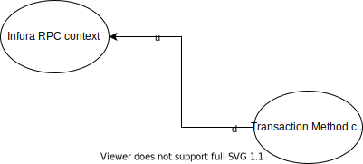
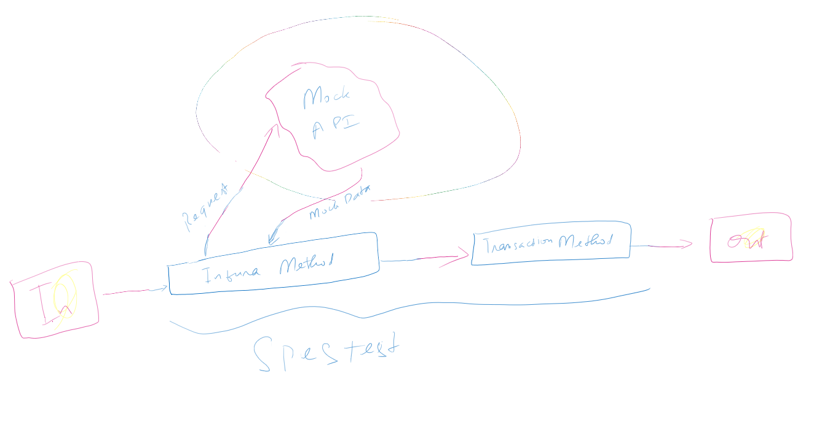

# BTC markets - Transaction solution

## Design

#### Context Map:


#### Class Diagram:

--------------------

- InfuraMethods and TransactionMethods are injectable in mvc webapp.
- TransactionMethods use input (as Task\<string\>) from InfuraMethods.
- InfuraMethods directly query Infura RPC endpoint to get back responses as Task\<string\>.
- TransactionMethods and InfuraMethods are to be implemented with Generic types to help guide new implementers.
- To create a new method follow the following steps:

1. Create InfuraMethod:
- Make sure this InfuraMethod implements the abstract class InfuraMethod\<inT\>. All it needs to do is overriding GetInfuraRequestContentV2()
e.g:
```
   public class GetBlockByNumber : InfuraMethod<(BlockNumber blockNumber, bool getTransactionDetails)>
    {
        public override InfuraRequestContentV2 GetInfuraRequestContentV2((BlockNumber blockNumber, bool getTransactionDetails) input)
            => new InfuraRequestContentV2(InfuraJsonRpcMethodNames.GetBlockByNumber,
                new object[] { $"0x{input.blockNumber.ToHex()}", input.getTransactionDetails });
    }
```
- Make the newly created method injectable in `ServiceCollectionExtensions.AddInfuraMethods` like following:
`services.AddSingleton<IInfuraMethod<(BlockNumber, bool)>, GetBlockByNumber>();`
(The above in the future can be auto-populated by reflection)

2. Create TransactionMethod: 
- create concreate method class implementing interface `ITransactionMethod<inT, outT>`. This will force you to implement inT, outT and Execute methods.
e.g:
```
    public class GetListOfTransactionDetailsFromAddressInBlockMethod : ITransactionMethod<(Address address, BlockNumber blockNumber), IEnumerable<TransactionDetails>>
       ...
```
- Make the newly created method injectable in `ServiceCollectionExtensions.AddTransactionMethods` like following:
`services.AddSingleton<ITransactionMethod<(Address address, BlockNumber blockNumber), IEnumerable<TransactionDetails>>, GetListOfTransactionDetailsFromAddressInBlockMethod>();`
(The above in the future can be auto-populated by reflection)

3. As consumer all you need to do is injecting the transaction method needed into your controller and make use of it.
e.g:
```
        private ITransactionMethod<(Address address, BlockNumber blockNumber), IEnumerable<TransactionDetails>> _getListOfTransactionDetailsFromAddressInBlockMethod;

        public TransactionController(ITransactionMethod<(Address address, BlockNumber blockNumber), IEnumerable<TransactionDetails>> getListOfTransactionDetailsFromAddressInBlockMethod)
        {
            _getListOfTransactionDetailsFromAddressInBlockMethod = getListOfTransactionDetailsFromAddressInBlockMethod;
        }
```

4. Testings:
- There are different layers of testings.
- ValueObjects tests are the lowest layer of testing, aiming to test the nature of value objects define (e.g: AddressEmptyShouldThrowExeption.)
- Specs tests are mandatory for each TransactionMethod class created. Tests are around the Execute method in the class. Make sure you cover all scenarios of the method specs (e.g: UnexisingBlockShouldReturnNoResult)
#### Specs Test Trategy

- If there are unit tests worth testing then add them in UnitTests.cs class.
- No tests are needed for InfuraMethods since these query RPC directly.
- Controller tests are tests on controller layer, making sure the controller return correct responses (e.g: SearchAsync_ShouldReturnOkIfNoException)

#### Notes
- validations on input and output data type are forced at compile time via generic typings.
- validations of input, output business rules will be enforced by ValueObjects and ReferenceObjects.
- ValueObjects are values in nature, and are immutable.

-----------------------------------
Language: dotnet core
Testing framework: xUnit
This solution focuses on backend so the front-end was left bare minimum react app.
Backend comprises of:
- TransactionController impolementing SearchAsync method to help searching for transactions of a specific address and block number.
- InfuraHttpClientInstanceFactory helps creating InfuraClientInstances on demand with utility methods in it to query the Infura api, at the moment there are: GetBlockByNumber, GetTransactionDetailsJArrayOfBlockNumber and GetTransactionDetailsJArrayOfBlockNumber for the time being with potential to extend to other api methods.
- Minimal Integration tests to query the api and make sure the client gets back what it needs. It would be more reliable to be able  to mock thesse api call and turn some into unit tests when there's time to do so.'
- Exceptions are not handled to allow raw errors to bubble up when debugging.

## Prerequisites 
dotnet core sdk
nodejs

## Run the app
To build front end project run `npm i` in ClientApp folder to install all npm packages.
In visual studio press F5 and it should run in debug mode.

#### TODO:
- Logging.
- Integration tests: (Haven't seen one).
- E2E tests: Tests on react app.

#### QUESTIONS:
- Are there going to be write operations?